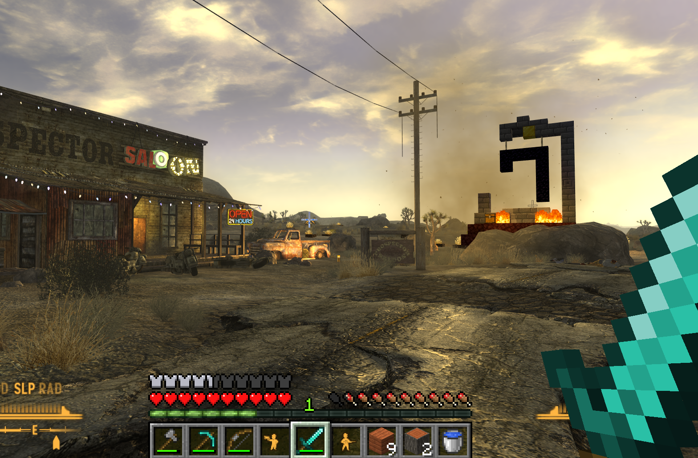

# VegasCraft



Play Fallout: New Vegas with Minecraft Java's movement, inventory, blocks, and combat. VegasCraft is an experimental Windows port inspired by [SkyCraft](https://github.com/chasmlol/SkyCraft), using a 32-bit xNVSE plugin and a 64-bit Fabric mod.

New Vegas renders the Mojave and its characters. Minecraft runs alongside it, provides gameplay and inventory, and sends block geometry and interface frames back to New Vegas. You play through the New Vegas window.

## Current version: 0.2.2

Documentation reviewed on **3 October 2026** for **0.2.2**, bridge protocol **v20**. This release fixes the frame-rate drop with the Pip-Boy open and improves lighting and rendering: frustum culling of Minecraft sections, mipmapped block textures, block light tinted by nearby emitters, hands lit by New Vegas' ambient and sun, a blob shadow under the third-person avatar, and a `skydump` probe to locate the engine's fog distances. It also keeps the 0.2.1 icon lookup fix for native inventory and STATS snapshots. Install the native loader, native core, and Fabric jar from the same build.

The current implementation includes:

- Automatic Minecraft startup through a bundled portable Prism Launcher or a launcher of your choice. Launching runs in a background thread so it does not block xNVSE initialization.
- Minecraft movement and collision against exported New Vegas geometry, with player synchronization across loads and cell changes.
- Minecraft block rendering, placement and removal, inventory, and HUD inside New Vegas.
- New Vegas inventory links in Minecraft's hotbar, with native counts and Pip-Boy images generated from the installed game's archives. Hotkeys 1-8 add links to free hotbar slots 1-8 without evicting Minecraft items. The Pip-Boy lists the full native inventory and supports picking up a link with the cursor and placing it in the hotbar. Links cannot enter Minecraft containers; New Vegas owns the actual items.
- The Pip-Boy, Minecraft style (Tab), with a detailed model, animated STATS/ITEMS/DATA buttons, a turning knob, and pages warped onto its screen. **STATS** shows live status, S.P.E.C.I.A.L., skills, perks, and general statistics. **ITEMS** shows native inventory categories with value and weight, equip/use/drop actions, hotbar links, and keys 1-8 to give the chosen item a New Vegas hotkey; F4 switches to Minecraft inventory and 3x3 crafting. **DATA** shows quests and tracking, notes, a radio you can tune (station playing, turn off), and a world map with markers, player heading, zoom/pan, and fast travel. The local map uses the native screen through **NV**.
- New Vegas ranged weapons wielded, fired, aimed, and reloaded by New Vegas; melee weapons use Minecraft's swing and hit feedback with native weapon models. Native gunshots can hit Minecraft mobs and blocks. Combat and player health are bridged between the games.
- First-person hand export, weapon depth occlusion, and a third-person Minecraft avatar holding native weapons. Minecraft arms are **hidden by default while holding a New Vegas ranged weapon**; `showArms 1` in `config/vegascraft_arms.txt` enables them for tuning.
- Minecraft trees, plants, structures, animals, and monsters on exported Mojave terrain. `bExportLand=0` disables land export; `mobs=false` disables the added mob spawner.
- Handling to push native actors sideways out of placed blocks, and native furniture interaction that temporarily returns movement to New Vegas before resynchronizing Minecraft.
- Native HUD suppression while Minecraft controls the player, retaining the compass, messages, and enemy health display.
- F5 first-person and third-person camera cycling.
- Native block lights and experimental exterior terrain digging, including landscape mesh cuts, texture-weight interpolation, player collision updates, and filtering native character contacts with removed ground.
- A small permanent xNVSE loader and a reloadable native core. Core-only changes can be deployed while New Vegas runs; loader, ABI, protocol, and Fabric changes require the relevant processes to restart.

Earlier testing confirmed block rendering, the interface overlay, combat, health, and automatic startup in the real games. Native light tuning also recorded visible light on nearby objects, with weak landscape response. The current source builds and its automated checks pass; the latest Pip-Boy pages, weapon/arm changes, world generation, and reload behavior still need the full in-game regression checklist. See [validation status](docs/VALIDATION.md).

## Requirements

| Component | Requirement |
| --- | --- |
| Operating system | Windows, supporting 32-bit New Vegas and 64-bit Java |
| Fallout: New Vegas | Standard executable **1.4.0.525** |
| Script extender | [xNVSE 6 or later](https://github.com/xNVSE/NVSE/releases) |
| Minecraft | Java Edition **26.3**, with an account that owns the game |
| Fabric Loader | **0.19.5 or later** |
| Fabric API | Bundled version: **0.161.0+26.3** |
| Java | **25**, 64-bit |

The bundle includes VegasCraft, Fabric API, and e4mc. Prism is configured to download Minecraft and Java after account setup. GECK and the NoGore executable are unsupported.

## Installation and first launch

1. Install New Vegas, launch it once to generate its settings, and install xNVSE.
2. Install `VegasCraft-0.2.2.zip` with MO2 or Vortex. For manual installation, extract it into New Vegas's **`Data` directory**. The archive starts with `NVSE/Plugins/`, so extracting directly beside `FalloutNV.exe` would put the plugin in the wrong location.
3. Check that the following files are installed or visible through your mod manager:

   ```text
   Fallout New Vegas/
     nvse_loader.exe
     Data/
       NVSE/
         Plugins/
           VegasCraft.dll
           VegasCraft.ini
           VegasCraft/
             VegasCraftCore.dll
             VegasCraft-Minecraft.zip
   ```

4. Start New Vegas through **`nvse_loader.exe`**. With MO2, launch xNVSE from MO2 so the plugin and bundle are available.
5. Complete Prism's Microsoft account sign-in and allow Minecraft and Java downloads to finish. Prism handles authentication.
6. Load a New Vegas save. The mod automatically opens or creates its Minecraft mirror world once connected.
7. Keep New Vegas focused. Press **E** to check the Minecraft inventory, close it, then press **G** while pointing at a door or NPC.

The portable launcher is unpacked to `%LOCALAPPDATA%\VegasCraft`. Instance data is under `%LOCALAPPDATA%\VegasCraft\Prism\instances\VegasCraft\.minecraft`. Bundle updates preserve account data and Minecraft worlds while replacing bundled mod jars.

Minecraft is configured to run with its window hidden. Prism may show setup or error dialogs. By default, Minecraft exits when New Vegas closes. For normal package updates, close and restart both games. During development, core-only updates support [hot reload](docs/DEVELOPMENT.md).

### Using your own launcher

Prepare a separate Minecraft 26.3 instance with Fabric Loader, Fabric API, Java 25, and `vegascraft-fabric-0.2.2.jar`. Add `--enable-native-access=ALL-UNNAMED` to its JVM arguments. Optionally add `-Dvegascraft.startHidden=true` to hide the Minecraft window.

Configure `Data/NVSE/Plugins/VegasCraft.ini`, for example:

```ini
[Minecraft]
bStartWithNewVegas=1
sLauncher=C:\Tools\PrismLauncher\prismlauncher.exe
sArguments=--launch VegasCraft
```

The instance name must match the arguments. Leave `sLauncher` empty to use the bundle, or set `bStartWithNewVegas=0` to start Minecraft yourself.

## Controls

These controls apply while Minecraft controls the player, using default New Vegas bindings.

| Key or input | Action |
| --- | --- |
| **WASD**, mouse, **Space** | Minecraft movement, looking, and jumping |
| **Left Shift**, **Left Ctrl** | Sprint, sneak (defaults are swapped to match New Vegas) |
| **Left mouse button** | Attack or hold to mine; fire when wielding a native ranged weapon |
| **Right mouse button** | Use an item or place a block; aim with a native ranged weapon |
| **R** | Reload a native ranged weapon |
| **1–9**, mouse wheel | Select a Minecraft hotbar slot |
| **E** | Minecraft inventory |
| **G** | New Vegas interaction: doors, dialogue, containers, and other activatable objects |
| **H** | New Vegas wait menu |
| **Tab** | Open/close the Pip-Boy with Minecraft pages |
| **F1**, **F2**, **F3** in the Pip-Boy | STATS, ITEMS, DATA |
| **F4** in Pip-Boy ITEMS | Switch between native items and Minecraft inventory/3x3 crafting |
| **Esc** | New Vegas pause menu during gameplay; closes a Minecraft screen when one is open |
| **O** | Minecraft pause/options menu |
| **T** | Minecraft chat |
| **F5** | First person, third person behind, third person in front |
| **F9** | New Vegas quickload |
| **Console key** | New Vegas console, using the usual grave/tilde key |

**Use G to enter buildings.** E opens Minecraft's inventory, following SkyCraft's scheme. VegasCraft forwards G as New Vegas's default E interaction key and H as its default T wait key. Custom native bindings may require adjustment.

While a Minecraft screen is open, keyboard input goes to that screen. Close it before interacting with New Vegas objects. Other gameplay keys follow Minecraft's bindings.

## Digging and current limits

Digging targets natural exterior landscape. Mine the ground, check the visible hole and player collision, and place blocks inside it. Buildings and other nondiggable geometry should remain intact.

The Minecraft menu opened with O contains a destruction toggle. Its **"Terrain destruction"** button controls terrain digging. The setting is stored as `destruction=true` or `destruction=false` in the instance's `config/vegascraft.properties`. Disabling it stops further digging and leaves existing holes in place.

- Holes are cut into New Vegas' landscape meshes (triangle strips, including their texture blend weights) and restored when they are cleared. Edges between cut triangles and the shared terrain textures still need a closer visual check.
- Block lights (torches, lava, fire) are registered as native point lights using exported colors and emitter types, with brightness tuned upward. Earlier night tests showed nearby rocks and objects lit clearly, but the landscape barely reacted; this still needs investigation.
- Native character contacts with removed ground are filtered, and actors are pushed sideways out of Minecraft blocks. Native NPC support on Minecraft block floors remains incomplete.
- Digging into arbitrary objects and removing grass from holes remain unfinished.
- The new Pip-Boy pages, camera/weapon combinations, lighting, landscape changes, and performance need systematic visual checks in the actual game. The automated render fixture exercises the old movement cube, not the complete current renderer.
- Full save synchronization is not established. New Vegas saves and the Minecraft mirror world are separate data; loading an older New Vegas save does not rewind Minecraft blocks or Minecraft's own items (New Vegas items follow the loaded save).
- e4mc and inherited joining code are included, but multiplayer in New Vegas has not been validated.
- Some inherited interface text, class names, and logs still mention Skyrim or SkyCraft.

Minecraft keeps dug cells in its own world data and resends them after loads and collision-epoch changes. This does not make the two save systems transactional. The Mojave uses Minecraft's overworld; other native worldspaces and interiors currently share the `vegascraft:elsewhere` dimension, so they are not all isolated from one another.

## Configuration and multiplayer

The shipped [INI](config/VegasCraft.ini) configures startup, land export, core reload, and the bridge name. Minecraft settings are stored in its instance under `config/vegascraft.properties`; arm tuning uses the separate `config/vegascraft_arms.txt`. See the [configuration reference](docs/CONFIGURATION.md) for defaults, paths, and when changes take effect.

Experimental multiplayer is included: a host opens **O → Open to LAN**; bundled e4mc supplies an address. A guest uses **T**, `/join <address>`, and `/leave` to return to their mirror world. Each player needs the mod and a local New Vegas host. These commands and networking code are present, but multiplayer gameplay and native save consistency have not been validated.

## In-game testing

After Minecraft finishes starting, load an exterior save such as Goodsprings:

1. Open the inventory with E, close it, and use a door or speak to an NPC with G.
2. Place a block, stand on it, and break it. Check rendering and collision.
3. Check Minecraft's hotbar and health, native health/AP/reticle suppression, and all Pip-Boy sections, item actions, hotbar links, and crafting.
4. Cycle F5 through all three views. Check returning to first person and approaching a wall.
5. Place a torch or lantern in a dark area. Check lighting on native surfaces and nearby characters, then remove it and check that the light disappears.
6. Mine exterior ground, enter the hole, place a block inside, and reload the save to check that dug geometry is reapplied.
7. Wield native ranged and melee weapons; fire, aim, reload, switch slots, and repeat in third person. Check hits on native actors and Minecraft mobs.

Report the first failing step, the triggering action, and what you see. [Detailed test notes](docs/TEST-0.2.2.md) are currently in Italian.

## Troubleshooting

### New Vegas does not open

Check Task Manager for a leftover `FalloutNV.exe` before launching again. Only one New Vegas process can own the default bridge; a log mentioning another host means a second process could not acquire it.

The synchronous launcher startup that could block DLL loading is fixed in this build. Check `VegasCraft.log` for `plugin initialization complete` and Minecraft launcher messages, and `nvse.log` for successful plugin loading.

### Minecraft runs but the inventory does not appear

Finish Prism's sign-in and download prompts, load a New Vegas save, and allow the mirror world to open. Connected gameplay should report `MC alive=1`, `inWorld=1`, and `puppet=1` in `VegasCraft.log`. After an unexpected shutdown, close both games and restart through xNVSE.

### Plugin loads but gameplay never connects

Check that `VegasCraftCore.dll` is installed under `Data/NVSE/Plugins/VegasCraft/` and that the log reports `core ready`. Both native code and Fabric must use protocol **20**; close both games and install matching artifacts if the log reports a protocol mismatch. A custom mapping name must also match Minecraft's `-Dvegascraft.link=...` argument.

### Pip-Boy icons or maps are missing

Minecraft generates its `vegascraft/nvicons` resource pack from the installed New Vegas `Data` folder. Check `latest.log` for data-folder or resource-generation errors. If automatic discovery fails, set `nvDataDir` in [Minecraft configuration](docs/CONFIGURATION.md) and restart Minecraft. Local maps and radio tuning still require the **NV** button.

### E opens inventory instead of a door

Close the inventory, point at the door, and press **G**. Restore the default E interaction binding in New Vegas if it was changed.

### Logs

- Plugin: `VegasCraft.log` beside `FalloutNV.exe`.
- xNVSE: `nvse.log` in the New Vegas directory.
- Bundled Minecraft: `%LOCALAPPDATA%\VegasCraft\Prism\instances\VegasCraft\.minecraft\logs\latest.log`.
- Custom Minecraft: `logs/latest.log` inside that instance's Minecraft directory.

## Building from source

Requires Windows, CMake 3.25 or later, Ninja, a C++20 compiler targeting **32-bit Windows**, and a **64-bit JDK 25**. Python is needed for the separate cross-process bridge test. The Gradle wrapper pins **9.7.1** and Fabric Loom **1.18.2**.

The helpers discover portable LLVM-MinGW and JDK installations under `.tools`, or accept explicit paths:

```powershell
./tools/Build-Native.ps1 -CompilerRoot C:\Tools\llvm-mingw
./tools/Build-Fabric.ps1 -JavaHome C:\Tools\jdk-25
python tools/test_bridge.py --java-home C:\Tools\jdk-25
./tools/Package.ps1
```

The native script builds and runs CTest. The Fabric script uses the Gradle wrapper and runs the build and tests. Packaging downloads pinned Prism, Fabric API, and e4mc artifacts and verifies their configured hashes.

| Output | Purpose |
| --- | --- |
| `build/native/VegasCraft.dll` | xNVSE plugin (loader: bridge, log, Minecraft launcher) |
| `build/native/VegasCraftCore.dll` | the plugin's core, installed as `Data/NVSE/Plugins/VegasCraft/VegasCraftCore.dll`; `tools/Deploy-Core.ps1` reloads it in a running New Vegas |
| `fabric/build/libs/vegascraft-fabric-0.2.2.jar` | Fabric mod |
| `dist/VegasCraft-0.2.2.zip` | New Vegas package with the portable launcher bundle |
| `dist/vegascraft-fabric-0.2.2.jar` | Separate jar for a custom instance |

CMake also supports MSVC configured for Win32. Packaging expects both DLLs in `build/native` and the jar in `fabric/build/libs`; the release archive includes both DLLs. `Package.ps1` pins Prism **11.1.1**, Fabric API **0.161.0+26.3**, and e4mc **6.2.2**. The Minecraft bundle zip is nested in the release and removed as a separate staging artifact. See [development and packaging](docs/DEVELOPMENT.md).

### Automated validation

Verification on 3 October 2026: **five native CTest cases pass**, including production Pip-Boy snapshot readers with invalid icon pointers, the Fabric build succeeds with **21 passing tests executed in this build**, and the cross-process bridge test passes:

- **Plugin lifecycle:** exports, runtime compatibility, xNVSE messages, load transitions, and bridge ownership/lifetime.
- **Homography:** Pip-Boy page corners, inverse cursor mapping, inset, and layout rectangle.
- **Pip-Boy data:** production inventory/STATS/quest snapshots, invalid icon pointers, memory page boundaries, and quest name/tracking/objective payloads.
- **Render fixture:** isolated Direct3D checks of the older movement-cube renderer and render-state handling.
- **Gameplay fixture:** dig packets, clipping and mesh ownership, collision updates, camera transforms, and light clustering.
- **Fabric tests:** ray queries and triangle collision behavior.

The additional Python test runs production Java bridge code in a 64-bit JVM against a separate 32-bit process. It checks state exchange and rejection of incompatible or truncated mappings. Fixtures complement the in-game checks; they do not prove visual correctness inside New Vegas.

## Next development priorities

The current focus is completing and validating:

1. **Terrain destruction:** complete native NPC support on Minecraft floors, digging beyond exterior landscape, grass removal, and persistence regression tests.
2. **Lighting:** placement, intensity, color, removal, and transitions in the actual New Vegas renderer.
3. **Pip-Boy and weapons:** validate all live data/actions, map travel, crafting, weapon switching, first/third-person models, and performance in game.
4. **World integration:** test generated features and mobs, furniture transitions, separation of interiors/worldspaces, and multiplayer.

These priorities include both unfinished behavior and validation of implemented behavior.

## Project layout

| Directory | Contents |
| --- | --- |
| `native/` | xNVSE plugin, gameplay, rendering, launcher, camera, lights, and digging |
| `fabric/` | Minecraft mod, gameplay, interface export, and mirror world |
| `protocol/` | Shared-memory protocol derived from SkyCraft, extended to v20 |
| `config/` | Default INI |
| `tests/` | Native fixtures and cross-process Java test peer |
| `tools/` | Build, packaging, inspection, and test helpers |
| `docs/` | Current configuration, development, rendering, validation, and in-game checklist; earlier records in `docs/history/` |

The bridge uses `Local\VegasCraft_v1` and **70 New Vegas units per Minecraft block**. The mapping name's `_v1` suffix is not the wire protocol version. C++ and Java currently require **v20**; this is no longer the unchanged SkyCraft v11 layout.

## Documentation

- [Configuration](docs/CONFIGURATION.md): native INI, Minecraft settings, launcher and arm options.
- [Development](docs/DEVELOPMENT.md): builds, checks, packaging, deployment, and core reload.
- [Rendering and bridge architecture](docs/RENDERING.md): current world, hands, HUD, Pip-Boy, lighting, and digging paths.
- [Validation](docs/VALIDATION.md): verified results, coverage, and remaining checks.
- [In-game checklist, Italian](docs/TEST-0.2.2.md): repeatable gameplay regression steps.
- [Historical validation](docs/history/VALIDATION-2026-10-01.md) and [movement cube](docs/history/MOVEMENT-CUBE.md): initial milestone records.

## Credits and license

VegasCraft uses the [MIT license](LICENSE). SkyCraft's MIT notice is preserved in [licenses/SkyCraft-MIT.txt](licenses/SkyCraft-MIT.txt). See [THIRD-PARTY-NOTICES.md](THIRD-PARTY-NOTICES.md) for source references; the launcher bundle contains its own notices.

The project is independent of Mojang, Microsoft, Bethesda, and ZeniMax. No Minecraft or Fallout game binaries, game textures, or account credentials are distributed.
